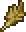
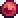
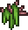
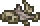
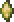
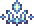
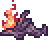

# calamityVanillaItemRecipeChanges

Calamity Vanilla Item Recipe Changes mod adds the vanilla crafting changes from Calamity to vanilla Terraria  
(Please note this mod does not work while the Calamity mod is enabled)

[View mod on Steam Workshop](https://steamcommunity.com/sharedfiles/filedetails/?id=2799233869)

<table>
  <tr>
    <th>Fast Travel</th>
  </tr>
  <tr>
    <td>
      <a href="#items-added-from-calamity">Items Added from Calamity</a>
       
      <a href="#crafting-recipes">Crafting Recipes</a>
    </td>
  </tr>
</table>

## Items Added from Calamity

Some items from calamity have been added for the crafting recipes.

(you can click an item or mob to go to its wiki page)

<table>
  <tr>
    <th>Item</th>
    <th>Drops from</th>
    <th>Drop rate</th>
  </tr>
  <tr>
    <td>
       Desert Feather
    </td>
    <td>
      <a href="https://terraria.wiki.gg/wiki/Vulture">
         Vulture </a>
    </td>
    <td>50%</td>
  </tr>
  <tr>
    <td>
       Blood Orb
    </td>
    <td>
      <a href="https://terraria.wiki.gg/wiki/Zombie">
         Zombie </a> (Blood Moon)  
      <a href="https://terraria.wiki.gg/wiki/Demon_Eye">
         Demon Eye </a> (Blood Moon)  
      <a href="https://terraria.wiki.gg/wiki/Blood_Zombie">
         Blood Zombie </a>
       
      <a href="https://terraria.wiki.gg/wiki/Drippler">
         Drippler </a>
       
      <a href="https://terraria.wiki.gg/wiki/The_Bride">
         The Bride </a>
       
      <a href="https://terraria.wiki.gg/wiki/The_Groom">
         The Groom </a>
       
      <a href="https://terraria.wiki.gg/wiki/Clown">
         Clown </a>
       
    </td>
    <td>50%</td>
  </tr>
  <tr>
    <td>
       Murky Paste
    </td>
    <td>
      <a href="https://terraria.wiki.gg/wiki/Arapaima">
         Arapaima </a>
       
      <a href="https://terraria.wiki.gg/wiki/Spiked_Jungle_Slime">
         Spiked Jungle Slime </a>
       
    </td>
    <td>25%</td>
  </tr>
  <tr>
    <td>
       Beetle Juice
    </td>
    <td>
      <a href="https://terraria.wiki.gg/wiki/Derpling">
         Derpling </a>
    </td>
    <td>25%</td>
  </tr>
  <tr>
    <td>
       Ancient Bone Dust
    </td>
    <td>
      <a href="https://terraria.wiki.gg/wiki/Skeleton">
         Skeleton </a>
       
      <a href="https://terraria.wiki.gg/wiki/Hoplite">
         Hoplite </a>
       
      <a href="https://terraria.wiki.gg/wiki/Armored_Skeleton">
         Armored Skeleton </a>
       
      <a href="https://terraria.wiki.gg/wiki/Skeleton_Archer">
         Skeleton Archer </a>
       
    </td>
    <td>25%</td>
  </tr>
  <tr>
    <td>
       Blighted Lens
    </td>
    <td>
      <a href="https://terraria.wiki.gg/wiki/Wandering_Eye">
         Wandering Eye </a>
       
    </td>
    <td>50%</td>
  </tr>
  <tr>
    <td rowspan="2">
       Essence of Eleum
    </td>
    <td>
      <a href="https://terraria.wiki.gg/wiki/Ice_Tortoise">
         Ice Tortoise </a>
       
      <a href="https://terraria.wiki.gg/wiki/Icy_Merman">
         Icy Merman </a>
       
      <a href="https://terraria.wiki.gg/wiki/Ice_Elemental">
         Ice Elemental </a>
    </td>
    <td>50%</td>
  </tr>
  <tr>
    <td>
      <a href="https://terraria.wiki.gg/wiki/Ice_Golem">
         Ice Golem </a>
    </td>
    <td>100%</td>
  </tr>
</table>

## Crafting Recipes

All crafting recipes that have been added

<table>
  <tr>
    <th>Fast Travel (Crafting Recipes)</th>
  </tr>
  <tr>
    <td>
      <a href="#accessories">Accessories</a>
       
      <a href="#ammunition">Ammunition</a>
       
      <a href="#armor">Armor</a>
       
      <a href="#consumables">Consumables</a>
       
      <a href="#crafting-stations">Crafting Stations</a>
       
      <a href="#placeables">Placeables</a>
       
      <a href="#potions">Potions</a>
       
      <a href="#tools">Tools</a> <a href="#weapons">Weapons</a>
    </td>
  </tr>
</table>

### Accessories

<table>
  <tr>
    <th>Result</th>
    <th>Ingredients</th>
    <th>Crafting Station</th>
  </tr>
  <tr>
    <td>
      <a href="https://terraria.wiki.gg/wiki/Magic_Quiver">
         Magic Quiver </a>
    </td>
    <td>
      <a href="https://terraria.wiki.gg/wiki/Endless_Quiver">
         Endless Quiver </a>
       
      <a href="https://terraria.wiki.gg/wiki/Pixie_Dust">
         Pixie Dust </a> (10)  
      <a href="https://github.com/SoaringGecko/calamityVanillaItemRecipeChanges1.4.gg/wiki#calamityvanillaitemrecipechanges">
         Blighted Lens </a> (5)  
      <a href="https://terraria.wiki.gg/wiki/Soul_of_Light">
         Soul of Light </a> (8)
    </td>
    <td>
      <a href="https://terraria.wiki.gg/wiki/Crystal_Ball">
         Crystal Ball </a>
    </td>
  </tr>
  <tr>
    <td>
      <a href="https://terraria.wiki.gg/wiki/Guide_Voodoo_Doll">
         Guide Voodoo Doll
    </td>
    <td>
      <a href="https://terraria.wiki.gg/wiki/Leather">
         Leather </a> (2)  
      <a href="https://calamitymod.gamepedia.com/Alternative_crafting_ingredients#Any_Evil_Powder">
         Any Evil Powder </a> (10)
    </td>
    <td>
      <a href="https://terraria.wiki.gg/wiki/Hellforge">
         Hellforge
    </td>
  </tr>
  <tr>
    <td>
      <a href="https://terraria.wiki.gg/wiki/Ice_Skates">
         Ice Skates </a>
    </td>
    <td>
      <a href="https://calamitymod.gamepedia.com/Alternative_crafting_ingredients#Any_Ice_Block">
         Any Ice Block </a> (20)  
      <a href="https://terraria.wiki.gg/wiki/Leather">
         Leather </a> (5)  
      <a href="https://terraria.wiki.gg/wiki/Alternative_crafting_ingredients#Any_Iron_Bar">
         Any Iron Bar </a> (5)
    </td>
    <td>
      <a href="https://terraria.wiki.gg/wiki/Ice_Machine">
         Ice Machine </a>
    </td>
  </tr>
  <tr>
    <td>
      <a href="https://terraria.wiki.gg/wiki/Aglet">
         Aglet </a>
    </td>
    <td>
      <a href="https://terraria.wiki.gg/wiki/Alternative_crafting_ingredients#Any_Iron_Bar">
         Any Iron Bar </a> (5)
    </td>
    <td rowspan="13">
      <a href="https://terraria.wiki.gg/wiki/Pre-Hardmode_Anvils">
         Iron Anvil </a>
       
      <b>or</b>
       
      <a href="https://terraria.wiki.gg/wiki/Pre-Hardmode_Anvils">
         Lead Anvil </a>
    </td>
  </tr>
  <tr>
    <td>
      <a href="https://terraria.wiki.gg/wiki/Anklet_of_the_Wind">
         Anklet of the Wind </a>
    </td>
    <td>
      <a href="https://terraria.wiki.gg/wiki/Jungle_Spores">
         Jungle Spore </a> (15)  
      <a href="https://terraria.wiki.gg/wiki/Cloud">
         Cloud </a> (15)  
      <a href="https://terraria.wiki.gg/wiki/Pink_Gel">
         Pink Gel </a> (5)
    </td>
  </tr>
  <tr>
    <td>
      <a href="https://terraria.wiki.gg/wiki/Bezoar">
         Bezoar </a>
    </td>
    <td>
      <a href="https://terraria.wiki.gg/wiki/Stinger">
         Stinger </a> (15)  
      <a href="https://calamitymod.wiki.gg/wiki/Desert_Feather">
         Murky Paste </a>
    </td>
  </tr>
  <tr>
    <td>
      <a href="https://terraria.wiki.gg/wiki/Blizzard_in_a_Bottle">
         Blizzard in a Bottle </a>
    </td>
    <td>
      <a href="https://terraria.wiki.gg/wiki/Feather">
         Feather </a> (2)  
      <a href="https://terraria.wiki.gg/wiki/Bottle">
         Bottle </a>
       
      <a href="https://terraria.wiki.gg/wiki/Snow_Block">
         Snow Block </a> (50)
    </td>
  </tr>
  <tr>
    <td>
      <a href="https://terraria.wiki.gg/wiki/Cloud_in_a_Bottle">
         Cloud in a Bottle </a>
    </td>
    <td>
      <a href="https://terraria.wiki.gg/wiki/Feather">
         Feather </a> (2)  
      <a href="https://terraria.wiki.gg/wiki/Bottle">
         Bottle </a>
       
      <a href="https://terraria.wiki.gg/wiki/Cloud">
         Cloud </a> (25)
    </td>
  </tr>
  <tr>
    <td>
      <a href="https://terraria.wiki.gg/wiki/Feral_Claws">
         Feral Claws </a>
    </td>
    <td>
      <a href="https://terraria.wiki.gg/wiki/Leather">
         Leather </a> (10)
    </td>
  </tr>
  <tr>
    <td>
      <a href="https://terraria.wiki.gg/wiki/Frog_Leg">
         Frog Leg </a>
    </td>
    <td>
      <a href="https://terraria.wiki.gg/wiki/Frog">
         Frog </a> (10)
    </td>
  </tr>
  <tr>
    <td>
      <a href="https://terraria.wiki.gg/wiki/Lava_Charm">
         Lava Charm </a>
    </td>
    <td>
      <a href="https://terraria.wiki.gg/wiki/Buckets">
         Lava Bucket </a> (5)  
      <a href="https://terraria.wiki.gg/wiki/Obsidian">
         Obsidian </a> (25)  
      <a href="https://terraria.wiki.gg/wiki/Alternative_crafting_ingredients#Any_Iron_Bar">
         Any Iron Bar </a> (5)
    </td>
  </tr>
  <tr>
    <td>
      <a href="https://terraria.wiki.gg/wiki/Lucky_Horseshoe">
         Lucky Horseshoe </a>
    </td>
    <td>
      <a href="https://terraria.wiki.gg/wiki/Sunplate_Block">
         Sunplate Block </a> (10)  
      <a href="https://terraria.wiki.gg/wiki/Cloud">
         Cloud </a> (10)  
      <a href="https://terraria.wiki.gg/wiki/Gold_Bar">
         Gold Bar </a>
      <b>or</b>
      <a href="https://terraria.wiki.gg/wiki/Platinum_Bar">
         Platinum Bar </a> (5)
    </td>
  </tr>
  <tr>
    <td>
      <a href="https://terraria.wiki.gg/wiki/Obsidian_Rose">
         Obsidian Rose </a>
    </td>
    <td>
      <a href="https://terraria.wiki.gg/wiki/Jungle_Rose">
         Jungle Rose </a>
       
      <a href="https://terraria.wiki.gg/wiki/Obsidian">
         Obsidian </a> (10)  
      <a href="https://terraria.wiki.gg/wiki/Hellstone">
         Hellstone </a> (10)
    </td>
  </tr>
  <tr>
    <td>
      <a href="https://terraria.wiki.gg/wiki/Radar">
         Radar </a>
    </td>
    <td>
      <a href="https://terraria.wiki.gg/wiki/Alternative_crafting_ingredients#Any_Iron_Bar">
         Any Iron Bar </a> (5)
    </td>
  </tr>
  <tr>
    <td>
      <a href="https://terraria.wiki.gg/wiki/Sandstorm_in_a_Bottle">
         Sandstorm in a Bottle </a>
    </td>
    <td>
      <a href="https://calamitymod.wiki.gg/wiki/Desert_Feather">
         Desert Feather </a> (10)  
      <a href="https://terraria.wiki.gg/wiki/Feather">
         Feather </a> (6)  
      <a href="https://terraria.wiki.gg/wiki/Bottle">
         Bottle </a>
       
      <a href="https://terraria.wiki.gg/wiki/Sand_Blocks">
         Sand Block </a> (70)
    </td>
  </tr>
  <tr>
    <td>
      <a href="https://terraria.wiki.gg/wiki/Water_Walking_Boots">
         Water Walking Boots </a>
    </td>
    <td>
      <a href="https://terraria.wiki.gg/wiki/Water_Walking_Potion">
         Water Walking Potion </a> (8)  
      <a href="https://terraria.wiki.gg/wiki/Leather">
         Leather </a> (5)
    </td>
  </tr>
  <tr>
    <td>
      <a href="https://terraria.wiki.gg/wiki/Flame_Waker_Boots">
         Flame Waker Boots </a>
    </td>
    <td>
      <a href="https://terraria.wiki.gg/wiki/Silk">
         Silk </a> (8)  
      <a href="https://terraria.wiki.gg/wiki/Obsidian">
         Obsidian </a> (2)
    </td>
    <td rowspan="4">
      <a href="https://terraria.wiki.gg/wiki/Loom">
         Loom </a>
    </td>
  </tr>
  <tr>
    <td>
      <a href="https://terraria.wiki.gg/wiki/Flower_Boots">
         Flower Boots </a>
    </td>
    <td>
      <a href="https://terraria.wiki.gg/wiki/Silk">
         Silk </a> (7)  
      <a href="https://terraria.wiki.gg/wiki/Jungle_Rose">
         Jungle Rose </a>
       
      <a href="https://terraria.wiki.gg/wiki/Jungle_Grass_Seeds">
         Jungle Grass Seeds </a> (5)
    </td>
  </tr>
  <tr>
    <td>
      <a href="https://terraria.wiki.gg/wiki/Hand_Warmer">
         Hand Warmer </a>
    </td>
    <td>
      <a href="https://terraria.wiki.gg/wiki/Silk">
         Silk </a> (5)  
      <a href="https://terraria.wiki.gg/wiki/Shiverthorn">
         Shiverthorn </a>
       
      <a href="https://terraria.wiki.gg/wiki/Snow_Block">
         Snow Block </a> (10)
    </td>
  </tr>
  <tr>
    <td>
      <a href="https://terraria.wiki.gg/wiki/Hermes_Boots">
         Hermes Boots </a>
    </td>
    <td>
      <a href="https://terraria.wiki.gg/wiki/Silk">
         Silk </a> (10)  
      <a href="https://terraria.wiki.gg/wiki/Swiftness_Potion">
         Swiftness Potion </a> (2)
    </td>
  </tr>
  <tr>
    <td>
      <a href="https://terraria.wiki.gg/wiki/Adhesive_Bandage">
         Adhesive Bandage </a>
    </td>
    <td>
      <a href="https://terraria.wiki.gg/wiki/Silk">
         Silk </a> (10)  
      <a href="https://terraria.wiki.gg/wiki/Gel">
         Gel </a> (50)  
      <a href="https://terraria.wiki.gg/wiki/Greater_Healing_Potion">
         Greater Healing Potion </a>
    </td>
    <td rowspan="13">
      <a href="https://terraria.wiki.gg/wiki/Hardmode_Anvils">
         Mythril Anvil </a>
       
      <b>or</b>
       
      <a href="https://terraria.wiki.gg/wiki/Hardmode_Anvils">
         Orichalcum Anvil </a>
    </td>
  </tr>
  <tr>
    <td>
      <a href="https://terraria.wiki.gg/wiki/Armor_Polish">
         Armor Polish </a>
    </td>
    <td>
      <a href="https://terraria.wiki.gg/wiki/Bone">
         Bone </a> (50)  
      <a href="https://calamitymod.wiki.gg/wiki/Desert_Feather">
         Ancient Bone Dust </a> (3)
    </td>
  </tr>
  <tr>
    <td>
      <a href="https://terraria.wiki.gg/wiki/Blindfold">
         Blindfold </a>
    </td>
    <td>
      <a href="https://terraria.wiki.gg/wiki/Silk">
         Silk </a> (30)  
      <a href="https://terraria.wiki.gg/wiki/Soul_of_Night">
         Soul of Night </a> (5)
    </td>
  </tr>
  <tr>
    <td>
      <a href="https://terraria.wiki.gg/wiki/Celestial_Magnet">
         Celestial Magnet </a>
    </td>
    <td>
      <a href="https://terraria.wiki.gg/wiki/Fallen_Star">
         Fallen Star </a> (20)  
      <a href="https://terraria.wiki.gg/wiki/Soul_of_Might">
         Soul of Might </a> (10)  
      <a href="https://terraria.wiki.gg/wiki/Soul_of_Light">
         Soul of Light </a> (5)  
      <a href="https://terraria.wiki.gg/wiki/Soul_of_Night">
         Soul of Night </a> (5)
    </td>
  </tr>
  <tr>
    <td>
      <a href="https://terraria.wiki.gg/wiki/Cobalt_Shield">
         Cobalt Shield </a>
    </td>
    <td>
      <a href="https://calamitymod.gamepedia.com/Alternative_crafting_ingredients#Any_Cobalt_Bar">
         Any Cobalt Bar </a> (10)
    </td>
  </tr>
  <tr>
    <td>
      <a href="https://terraria.wiki.gg/wiki/Fast_Clock">
         Fast Clock </a>
    </td>
    <td>
      <a href="https://terraria.wiki.gg/wiki/Timers">
         1 Second Timer </a>
       
      <a href="https://terraria.wiki.gg/wiki/Pixie_Dust">
         Pixie Dust </a> (15)  
      <a href="https://terraria.wiki.gg/wiki/Soul_of_Light">
         Soul of Light </a> (5)
    </td>
  </tr>
  <tr>
    <td>
      <a href="https://terraria.wiki.gg/wiki/Flying_Carpet">
         Flying Carpet </a>
    </td>
    <td>
      <a href="https://terraria.wiki.gg/wiki/Ancient_Cloth">
         Ancient Cloth </a> (10)  
      <a href="https://terraria.wiki.gg/wiki/Soul_of_Night">
         Soul of Night </a> (5)  
      <a href="https://terraria.wiki.gg/wiki/Soul_of_Light">
         Soul of Light </a> (10)
    </td>
  </tr>
  <tr>
    <td>
      <a href="https://terraria.wiki.gg/wiki/Frozen_Turtle_Shell">
         Frozen Turtle Shell </a>
    </td>
    <td>
      <a href="https://terraria.wiki.gg/wiki/Turtle_Shell">
         Turtle Shell </a> (3)  
      <a href="https://calamitymod.wiki.gg/wiki/Desert_Feather">
         Essence of Eleum </a> (9)
    </td>
  </tr>
  <tr>
    <td>
      <a href="https://terraria.wiki.gg/wiki/Megaphone">
         Megaphone </a>
    </td>
    <td>
      <a href="https://terraria.wiki.gg/wiki/Wire">
         Wire </a> (10)  
      <a href="https://terraria.wiki.gg/wiki/Hallowed_Bar">
         Hallowed Bar </a> (5)  
      <a href="https://terraria.wiki.gg/wiki/Ruby">
         Ruby </a> (3)
    </td>
  </tr>
  <tr>
    <td>
      <a href="https://terraria.wiki.gg/wiki/Metal_Detector">
         Metal Detector </a>
    </td>
    <td>
      <a href="https://terraria.wiki.gg/wiki/Wire">
         Wire </a> (10)  
      <a href="https://terraria.wiki.gg/wiki/Gold_Dust">
         Gold Dust </a> (5)  
      <a href="https://terraria.wiki.gg/wiki/Spelunker_Glowstick">
         Spelunker Glowstick </a> (5)  
      <a href="https://terraria.wiki.gg/wiki/Alternative_crafting_ingredients#Any_Iron_Bar">
         Any Iron Bar </a> (5)
    </td>
  </tr>
  <tr>
    <td>
      <a href="https://terraria.wiki.gg/wiki/Nazar">
         Nazar </a>
    </td>
    <td>
      <a href="https://terraria.wiki.gg/wiki/Soul_of_Night">
         Soul of Night </a> (20)  
      <a href="https://terraria.wiki.gg/wiki/Lens">
         Lens </a> (5)
    </td>
  </tr>
  <tr>
    <td>
      <a href="https://terraria.wiki.gg/wiki/Trifold_Map">
         Trifold Map </a>
    </td>
    <td>
      <a href="https://terraria.wiki.gg/wiki/Silk">
         Silk </a> (20)  
      <a href="https://terraria.wiki.gg/wiki/Soul_of_Light">
         Soul of Light </a> (3)  
      <a href="https://terraria.wiki.gg/wiki/Soul_of_Night">
         Soul of Night </a> (3)
    </td>
  </tr>
  <tr>
    <td>
      <a href="https://terraria.wiki.gg/wiki/Vitamins">
         Vitamins </a>
    </td>
    <td>
      <a href="https://terraria.wiki.gg/wiki/Bottled_Water">
         Bottled Water </a>
       
      <a href="https://terraria.wiki.gg/wiki/Waterleaf">
         Waterleaf </a> (5)  
      <a href="https://terraria.wiki.gg/wiki/Blinkroot">
         Blinkroot </a> (5)  
      <a href="https://terraria.wiki.gg/wiki/Daybloom">
         Daybloom </a> (5)  
      <a href="https://calamitymod.wiki.gg/wiki/Desert_Feather">
         Beetle Juice </a> (3)
    </td>
  </tr>
  <tr>
    <td>
      <a href="https://terraria.wiki.gg/wiki/Shiny_Red_Balloon">
         Shiny Red Balloon </a>
    </td>
    <td>
      <a href="https://terraria.wiki.gg/wiki/Gel">
         Gel </a> (80)  
      <a href="https://terraria.wiki.gg/wiki/Cloud">
         Cloud </a> (40)  
      <a href="https://terraria.wiki.gg/wiki/Strings">
         White String </a>
    </td>
    <td>
      <a href="https://terraria.wiki.gg/wiki/Solidifier">
         Solidifier </a>
    </td>
  </tr>
</table>

### Ammunition

<table>
  <tr>
    <th>Result</th>
    <th>Ingredients</th>
    <th>Crafting Station</th>
  </tr>
  <tr>
    <td>
      <a href="https://terraria.wiki.gg/wiki/Rockets">
         Rocket I </a> (20)
    </td>
    <td>
      <a href="https://terraria.wiki.gg/wiki/Empty_Bullet">
         Empty Bullet </a> (20)  
      <a href="https://terraria.wiki.gg/wiki/Explosive_Powder">
         Explosive Powder </a>
    </td>
    <td rowspan="2">
      <a href="https://terraria.wiki.gg/wiki/Hardmode_Anvils">
         Mythril Anvil </a>
       
      <b>or</b>
       
      <a href="https://terraria.wiki.gg/wiki/Hardmode_Anvils">
         Orichalcum Anvil </a>
    </td>
  </tr>
  <tr>
    <td>
      <a href="https://terraria.wiki.gg/wiki/Rockets">
         Rocket II </a> (20)
    </td>
    <td>
      <a href="https://terraria.wiki.gg/wiki/Empty_Bullet">
         Empty Bullet </a> (20)  
      <a href="https://terraria.wiki.gg/wiki/Explosive_Powder">
         Explosive Powder </a> (2)
    </td>
  </tr>
</table>

### Armor

<table>
  <tr>
    <th>Result</th>
    <th>Ingredients</th>
    <th>Crafting Station</th>
  </tr>
  <tr>
    <td>
      <a href="https://terraria.wiki.gg/wiki/Snow_armor">
         Eskimo Coat </a>
    </td>
    <td>
      <a href="https://terraria.wiki.gg/wiki/Silk">
         Silk </a> (8)  
      <a href="https://terraria.wiki.gg/wiki/Leather">
         Leather </a>
       
      <a href="https://terraria.wiki.gg/wiki/Boreal_Wood">
         Boreal Wood </a> (18)
    </td>
    <td rowspan="3">
      <a href="https://terraria.wiki.gg/wiki/Loom">
         Loom </a>
    </td>
  </tr>
  <tr>
    <td>
      <a href="https://terraria.wiki.gg/wiki/Snow_armor">
         Snow Hood </a>
    </td>
    <td>
      <a href="https://terraria.wiki.gg/wiki/Silk">
         Silk </a> (4)  
      <a href="https://terraria.wiki.gg/wiki/Leather">
         Leather </a>
       
      <a href="https://terraria.wiki.gg/wiki/Boreal_Wood">
         Boreal Wood </a> (12)
    </td>
  </tr>
  <tr>
    <td>
      <a href="https://terraria.wiki.gg/wiki/Snow_armor">
         Snow Pants </a>
    </td>
    <td>
      <a href="https://terraria.wiki.gg/wiki/Silk">
         Silk </a> (6)  
      <a href="https://terraria.wiki.gg/wiki/Leather">
         Leather </a>
       
      <a href="https://terraria.wiki.gg/wiki/Boreal_Wood">
         Boreal Wood </a> (15)
    </td>
  </tr>
</table>

### Consumables

<table>
  <tr>
    <th>Result</th>
    <th>Ingredients</th>
    <th>Crafting Station</th>
  </tr>
  <tr>
    <td>
      <a href="https://terraria.wiki.gg/wiki/Truffle_Worm">
         Truffle Worm </a>
    </td>
    <td>
      <a href="https://terraria.wiki.gg/wiki/Worm">
         Worm </a>
       
      <a href="https://terraria.wiki.gg/wiki/Glowing_Mushroom">
         Glowing Mushroom </a> (15)
    </td>
    <td>
      <a href="https://terraria.wiki.gg/wiki/Autohammer">
         Autohammer </a>
    </td>
  </tr>
  <tr>
    <td>
      <a href="https://terraria.wiki.gg/wiki/Life_Crystal">
         Life Crystal </a>
    </td>
    <td>
      <a href="https://terraria.wiki.gg/wiki/Bone">
         Bone </a> (5)  
      <a href="https://terraria.wiki.gg/wiki/Pink_Gel">
         Pink Gel </a>
       
      <a href="https://terraria.wiki.gg/wiki/Healing_Potion">
         Healing Potion </a>
       
      <a href="https://terraria.wiki.gg/wiki/Ruby">
         Ruby </a>
    </td>
    <td>
      <a href="https://terraria.wiki.gg/wiki/Pre-Hardmode_Anvils">
         Iron Anvil </a>
       
      <b>or</b>
       
      <a href="https://terraria.wiki.gg/wiki/Pre-Hardmode_Anvils">
         Lead Anvil </a>
    </td>
  </tr>
  <tr>
    <td>
      <a href="https://terraria.wiki.gg/wiki/Lihzahrd_Power_Cell">
         Lihzahrd Power Cell </a>
    </td>
    <td>
      <a href="https://terraria.wiki.gg/wiki/Lihzahrd_Brick">
         Lihzahrd Brick </a> (15)
    </td>
    <td>
      <a href="https://terraria.wiki.gg/wiki/Lihzahrd_Furnace">
         Lihzahrd Furnace </a>
    </td>
  </tr>
  <tr>
    <td>
      <a href="https://terraria.wiki.gg/wiki/Black_Lens">
         Black Lens </a>
    </td>
    <td>
      <a href="https://terraria.wiki.gg/wiki/Lens">
         Lens </a>
       
      <a href="https://terraria.wiki.gg/wiki/Dyes#Black_Dye">
         Black Dye </a>
    </td>
    <td>
      <a href="https://terraria.wiki.gg/wiki/Dye_Vat">
         Dye Vat </a>
    </td>
  </tr>
  <tr>
    <td>
      <a href="https://terraria.wiki.gg/wiki/Leather">
         Leather </a>
    </td>
    <td>
      <a href="https://terraria.wiki.gg/wiki/Vertebra">
         Vertebrae </a> (5)
    </td>
    <td>
      <a href="https://terraria.wiki.gg/wiki/Work_Benches">
         Work Bench </a>
    </td>
  </tr>
</table>

### Crafting Stations

<table>
  <tr>
    <th>Result</th>
    <th>Ingredients</th>
    <th>Crafting Station</th>
  </tr>
  <tr>
    <td>
      <a href="https://terraria.wiki.gg/wiki/Ice_Machine">
         Ice Machine </a>
    </td>
    <td>
      <a href="https://calamitymod.gamepedia.com/Alternative_crafting_ingredients#Any_Ice_Block">
         Any Ice Block </a> (25)  
      <a href="https://terraria.wiki.gg/wiki/Snow_Block">
         Snow Block </a> (15)  
      <a href="https://terraria.wiki.gg/wiki/Alternative_crafting_ingredients#Any_Iron_Bar">
         Any Iron Bar </a> (3)
    </td>
    <td rowspan="2">
      <a href="https://terraria.wiki.gg/wiki/Pre-Hardmode_Anvils">
         Iron Anvil </a>
       
      <b>or</b>
       
      <a href="https://terraria.wiki.gg/wiki/Pre-Hardmode_Anvils">
         Lead Anvil </a>
    </td>
  </tr>
  <tr>
    <td>
      <a href="https://terraria.wiki.gg/wiki/Sky_Mill">
         Sky Mill </a>
    </td>
    <td>
      <a href="https://terraria.wiki.gg/wiki/Sunplate_Block">
         Sunplate Block </a> (10)  
      <a href="https://terraria.wiki.gg/wiki/Cloud">
         Cloud </a> (5)  
      <a href="https://terraria.wiki.gg/wiki/Rain_Cloud">
         Rain Cloud </a> (3)
    </td>
  </tr>
</table>

### Placeables

<table>
  <tr>
    <th>Result</th>
    <th>Ingredients</th>
    <th>Crafting Station</th>
  </tr>
  <tr>
    <td>
      <a href="https://terraria.wiki.gg/wiki/Bast_Statue">
         Bast Statue </a>
    </td>
    <td>
      
      <a href="https://terraria.wiki.gg/wiki/Alternative_crafting_ingredients#Any_Iron_Bar"> Any Iron Bar</a> (7)  
      
      <a href="https://calamitymod.wiki.gg/wiki/Any_Gold_Bar"> Any Gold Bar</a> (3)  
      <a href="https://terraria.wiki.gg/wiki/Ruby">
         Ruby </a>
    </td>
    <td rowspan="1">
      <a href="https://terraria.wiki.gg/wiki/Pre-Hardmode_Anvils">
         Iron Anvil </a>
       
      <b>or</b>
       
      <a href="https://terraria.wiki.gg/wiki/Pre-Hardmode_Anvils">
         Lead Anvil </a>
    </td>
  </tr>
</table>

### Potions

<table>
  <tr>
    <th>Result</th>
    <th>Ingredients</th>
    <th>Crafting Station</th>
  </tr>
  <tr>
    <td>
      <a href="https://terraria.wiki.gg/wiki/Ammo_Reservation_Potion">
         Ammo Reservation Potion </a>
    </td>
    <td>
      <a href="https://terraria.wiki.gg/wiki/Bottled_Water">
         Bottled Water </a>
       
      <a href="https://calamitymod.wiki.gg/wiki/Blood_Orb">
         Blood Orb </a> (10)
    </td>
    <td rowspan="46">
      <a href="https://terraria.wiki.gg/wiki/Alchemy_Table">
         Alchemy Table </a>
    </td>
  </tr>
  <tr>
    <td>
      <a href="https://terraria.wiki.gg/wiki/Archery_Potion">
         Archery Potion </a>
    </td>
    <td>
      <a href="https://terraria.wiki.gg/wiki/Bottled_Water">
         Bottled Water </a>
       
      <a href="https://calamitymod.wiki.gg/wiki/Blood_Orb">
         Blood Orb </a> (10)
    </td>
  </tr>
  <tr>
    <td>
      <a href="https://terraria.wiki.gg/wiki/Battle_Potion">
         Battle Potion </a>
    </td>
    <td>
      <a href="https://terraria.wiki.gg/wiki/Bottled_Water">
         Bottled Water </a>
       
      <a href="https://calamitymod.wiki.gg/wiki/Blood_Orb">
         Blood Orb </a> (10)
    </td>
  </tr>
  <tr>
    <td>
      <a href="https://terraria.wiki.gg/wiki/Builder_Potion">
         Builder Potion </a>
    </td>
    <td>
      <a href="https://terraria.wiki.gg/wiki/Bottled_Water">
         Bottled Water </a>
       
      <a href="https://calamitymod.wiki.gg/wiki/Blood_Orb">
         Blood Orb </a> (10)
    </td>
  </tr>
  <tr>
    <td>
      <a href="https://terraria.wiki.gg/wiki/Calming_Potion">
         Calming Potion </a>
    </td>
    <td>
      <a href="https://terraria.wiki.gg/wiki/Bottled_Water">
         Bottled Water </a>
       
      <a href="https://calamitymod.wiki.gg/wiki/Blood_Orb">
         Blood Orb </a> (10)
    </td>
  </tr>
  <tr>
    <td>
      <a href="https://terraria.wiki.gg/wiki/Crate_Potion">
         Crate Potion </a>
    </td>
    <td>
      <a href="https://terraria.wiki.gg/wiki/Bottled_Water">
         Bottled Water </a>
       
      <a href="https://calamitymod.wiki.gg/wiki/Blood_Orb">
         Blood Orb </a> (10)
    </td>
  </tr>
  <tr>
    <td>
      <a href="https://terraria.wiki.gg/wiki/Dangersense_Potion">
         Dangersense Potion </a>
    </td>
    <td>
      <a href="https://terraria.wiki.gg/wiki/Bottled_Water">
         Bottled Water </a>
       
      <a href="https://calamitymod.wiki.gg/wiki/Blood_Orb">
         Blood Orb </a> (10)
    </td>
  </tr>
  <tr>
    <td>
      <a href="https://terraria.wiki.gg/wiki/Endurance_Potion">
         Endurance Potion </a>
    </td>
    <td>
      <a href="https://terraria.wiki.gg/wiki/Bottled_Water">
         Bottled Water </a>
       
      <a href="https://calamitymod.wiki.gg/wiki/Blood_Orb">
         Blood Orb </a> (10)
    </td>
  </tr>
  <tr>
    <td>
      <a href="https://terraria.wiki.gg/wiki/Featherfall_Potion">
         Featherfall Potion </a>
    </td>
    <td>
      <a href="https://terraria.wiki.gg/wiki/Bottled_Water">
         Bottled Water </a>
       
      <a href="https://calamitymod.wiki.gg/wiki/Blood_Orb">
         Blood Orb </a> (10)
    </td>
  </tr>
  <tr>
    <td>
      <a href="https://terraria.wiki.gg/wiki/Fishing_Potion">
         Fishing Potion </a>
    </td>
    <td>
      <a href="https://terraria.wiki.gg/wiki/Bottled_Water">
         Bottled Water </a>
       
      <a href="https://calamitymod.wiki.gg/wiki/Blood_Orb">
         Blood Orb </a> (10)
    </td>
  </tr>
  <tr>
    <td>
      <a href="https://terraria.wiki.gg/wiki/Flipper_Potion">
         Flipper Potion </a>
    </td>
    <td>
      <a href="https://terraria.wiki.gg/wiki/Bottled_Water">
         Bottled Water </a>
       
      <a href="https://calamitymod.wiki.gg/wiki/Blood_Orb">
         Blood Orb </a> (10)
    </td>
  </tr>
  <tr>
    <td>
      <a href="https://terraria.wiki.gg/wiki/Gender_Change_Potion">
         Gender Change Potion </a>
    </td>
    <td>
      <a href="https://terraria.wiki.gg/wiki/Bottled_Water">
         Bottled Water </a>
       
      <a href="https://calamitymod.wiki.gg/wiki/Blood_Orb">
         Blood Orb </a> (10)
    </td>
  </tr>
  <tr>
    <td>
      <a href="https://terraria.wiki.gg/wiki/Gills_Potion">
         Gills Potion </a>
    </td>
    <td>
      <a href="https://terraria.wiki.gg/wiki/Bottled_Water">
         Bottled Water </a>
       
      <a href="https://calamitymod.wiki.gg/wiki/Blood_Orb">
         Blood Orb </a> (10)
    </td>
  </tr>
  <tr>
    <td>
      <a href="https://terraria.wiki.gg/wiki/Gravitation_Potion">
         Gravitation Potion </a>
    </td>
    <td>
      <a href="https://terraria.wiki.gg/wiki/Bottled_Water">
         Bottled Water </a>
       
      <a href="https://calamitymod.wiki.gg/wiki/Blood_Orb">
         Blood Orb </a> (10)
    </td>
  </tr>
  <tr>
    <td>
      <a href="https://terraria.wiki.gg/wiki/Heartreach_Potion">
         Heartreach Potion </a>
    </td>
    <td>
      <a href="https://terraria.wiki.gg/wiki/Bottled_Water">
         Bottled Water </a>
       
      <a href="https://calamitymod.wiki.gg/wiki/Blood_Orb">
         Blood Orb </a> (10)
    </td>
  </tr>
  <tr>
    <td>
      <a href="https://terraria.wiki.gg/wiki/Luck_Potions">
         Greater Luck Potion </a>
    </td>
    <td>
      <a href="https://terraria.wiki.gg/wiki/Bottled_Water">
         Bottled Water </a>
       
      <a href="https://calamitymod.wiki.gg/wiki/Blood_Orb">
         Blood Orb </a> (10)
    </td>
  </tr>
  <tr>
    <td>
      <a href="https://terraria.wiki.gg/wiki/Hunter_Potion">
         Hunter Potion </a>
    </td>
    <td>
      <a href="https://terraria.wiki.gg/wiki/Bottled_Water">
         Bottled Water </a>
       
      <a href="https://calamitymod.wiki.gg/wiki/Blood_Orb">
         Blood Orb </a> (10)
    </td>
  </tr>
  <tr>
    <td>
      <a href="https://terraria.wiki.gg/wiki/Inferno_Potion">
         Inferno Potion </a>
    </td>
    <td>
      <a href="https://terraria.wiki.gg/wiki/Bottled_Water">
         Bottled Water </a>
       
      <a href="https://calamitymod.wiki.gg/wiki/Blood_Orb">
         Blood Orb </a> (10)
    </td>
  </tr>
  <tr>
    <td>
      <a href="https://terraria.wiki.gg/wiki/Invisibility_Potion">
         Invisibility Potion </a>
    </td>
    <td>
      <a href="https://terraria.wiki.gg/wiki/Bottled_Water">
         Bottled Water </a>
       
      <a href="https://calamitymod.wiki.gg/wiki/Blood_Orb">
         Blood Orb </a> (10)
    </td>
  </tr>
  <tr>
    <td>
      <a href="https://terraria.wiki.gg/wiki/Ironskin_Potion">
         Ironskin Potion </a>
    </td>
    <td>
      <a href="https://terraria.wiki.gg/wiki/Bottled_Water">
         Bottled Water </a>
       
      <a href="https://calamitymod.wiki.gg/wiki/Blood_Orb">
         Blood Orb </a> (10)
    </td>
  </tr>
  <tr>
    <td>
      <a href="https://terraria.wiki.gg/wiki/Luck_Potions">
         Lesser Luck Potion </a>
    </td>
    <td>
      <a href="https://terraria.wiki.gg/wiki/Bottled_Water">
         Bottled Water </a>
       
      <a href="https://calamitymod.wiki.gg/wiki/Blood_Orb">
         Blood Orb </a> (10)
    </td>
  </tr>
  <tr>
    <td>
      <a href="https://terraria.wiki.gg/wiki/Lifeforce_Potion">
         Lifeforce Potion </a>
    </td>
    <td>
      <a href="https://terraria.wiki.gg/wiki/Bottled_Water">
         Bottled Water </a>
       
      <a href="https://calamitymod.wiki.gg/wiki/Blood_Orb">
         Blood Orb </a> (10)
    </td>
  </tr>
  <tr>
    <td>
      <a href="https://terraria.wiki.gg/wiki/Love_Potion">
         Love Potion </a>
    </td>
    <td>
      <a href="https://terraria.wiki.gg/wiki/Bottled_Water">
         Bottled Water </a>
       
      <a href="https://calamitymod.wiki.gg/wiki/Blood_Orb">
         Blood Orb </a> (10)
    </td>
  </tr>
  <tr>
    <td>
      <a href="https://terraria.wiki.gg/wiki/Luck_Potions">
         Luck Potion </a>
    </td>
    <td>
      <a href="https://terraria.wiki.gg/wiki/Bottled_Water">
         Bottled Water </a>
       
      <a href="https://calamitymod.wiki.gg/wiki/Blood_Orb">
         Blood Orb </a> (10)
    </td>
  </tr>
  <tr>
    <td>
      <a href="https://terraria.wiki.gg/wiki/Magic_Power_Potion">
         Magic Power Potion </a>
    </td>
    <td>
      <a href="https://terraria.wiki.gg/wiki/Bottled_Water">
         Bottled Water </a>
       
      <a href="https://calamitymod.wiki.gg/wiki/Blood_Orb">
         Blood Orb </a> (10)
    </td>
  </tr>
  <tr>
    <td>
      <a href="https://terraria.wiki.gg/wiki/Mana_Regeneration_Potion">
         Mana Regeneration Potion </a>
    </td>
    <td>
      <a href="https://terraria.wiki.gg/wiki/Bottled_Water">
         Bottled Water </a>
       
      <a href="https://calamitymod.wiki.gg/wiki/Blood_Orb">
         Blood Orb </a> (10)
    </td>
  </tr>
  <tr>
    <td>
      <a href="https://terraria.wiki.gg/wiki/Mining_Potion">
         Mining Potion </a>
    </td>
    <td>
      <a href="https://terraria.wiki.gg/wiki/Bottled_Water">
         Bottled Water </a>
       
      <a href="https://calamitymod.wiki.gg/wiki/Blood_Orb">
         Blood Orb </a> (10)
    </td>
  </tr>
  <tr>
    <td>
      <a href="https://terraria.wiki.gg/wiki/Night_Owl_Potion">
         Night Owl Potion </a>
    </td>
    <td>
      <a href="https://terraria.wiki.gg/wiki/Bottled_Water">
         Bottled Water </a>
       
      <a href="https://calamitymod.wiki.gg/wiki/Blood_Orb">
         Blood Orb </a> (10)
    </td>
  </tr>
  <tr>
    <td>
      <a href="https://terraria.wiki.gg/wiki/Obsidian_Skin_Potion">
         Obsidian Skin Potion </a>
    </td>
    <td>
      <a href="https://terraria.wiki.gg/wiki/Bottled_Water">
         Bottled Water </a>
       
      <a href="https://calamitymod.wiki.gg/wiki/Blood_Orb">
         Blood Orb </a> (10)
    </td>
  </tr>
  <tr>
    <td>
      <a href="https://terraria.wiki.gg/wiki/Rage_Potion">
         Rage Potion </a>
    </td>
    <td>
      <a href="https://terraria.wiki.gg/wiki/Bottled_Water">
         Bottled Water </a>
       
      <a href="https://calamitymod.wiki.gg/wiki/Blood_Orb">
         Blood Orb </a> (10)
    </td>
  </tr>
  <tr>
    <td>
      <a href="https://terraria.wiki.gg/wiki/Regeneration_Potion">
         Regeneration Potion </a>
    </td>
    <td>
      <a href="https://terraria.wiki.gg/wiki/Bottled_Water">
         Bottled Water </a>
       
      <a href="https://calamitymod.wiki.gg/wiki/Blood_Orb">
         Blood Orb </a> (10)
    </td>
  </tr>
  <tr>
    <td>
      <a href="https://terraria.wiki.gg/wiki/Shine_Potion">
         Shine Potion </a>
    </td>
    <td>
      <a href="https://terraria.wiki.gg/wiki/Bottled_Water">
         Bottled Water </a>
       
      <a href="https://calamitymod.wiki.gg/wiki/Blood_Orb">
         Blood Orb </a> (10)
    </td>
  </tr>
  <tr>
    <td>
      <a href="https://terraria.wiki.gg/wiki/Sonar_Potion">
         Sonar Potion </a>
    </td>
    <td>
      <a href="https://terraria.wiki.gg/wiki/Bottled_Water">
         Bottled Water </a>
       
      <a href="https://calamitymod.wiki.gg/wiki/Blood_Orb">
         Blood Orb </a> (10)
    </td>
  </tr>
  <tr>
    <td>
      <a href="https://terraria.wiki.gg/wiki/Spelunker_Potion">
         Spelunker Potion </a>
    </td>
    <td>
      <a href="https://terraria.wiki.gg/wiki/Bottled_Water">
         Bottled Water </a>
       
      <a href="https://calamitymod.wiki.gg/wiki/Blood_Orb">
         Blood Orb </a> (10)
    </td>
  </tr>
  <tr>
    <td>
      <a href="https://terraria.wiki.gg/wiki/Stink_Potion">
         Stink Potion </a>
    </td>
    <td>
      <a href="https://terraria.wiki.gg/wiki/Bottled_Water">
         Bottled Water </a>
       
      <a href="https://calamitymod.wiki.gg/wiki/Blood_Orb">
         Blood Orb </a> (10)
    </td>
  </tr>
  <tr>
    <td>
      <a href="https://terraria.wiki.gg/wiki/Summoning_Potion">
         Summoning Potion </a>
    </td>
    <td>
      <a href="https://terraria.wiki.gg/wiki/Bottled_Water">
         Bottled Water </a>
       
      <a href="https://calamitymod.wiki.gg/wiki/Blood_Orb">
         Blood Orb </a> (10)
    </td>
  </tr>
  <tr>
    <td>
      <a href="https://terraria.wiki.gg/wiki/Swiftness_Potion">
         Swiftness Potion </a>
    </td>
    <td>
      <a href="https://terraria.wiki.gg/wiki/Bottled_Water">
         Bottled Water </a>
       
      <a href="https://calamitymod.wiki.gg/wiki/Blood_Orb">
         Blood Orb </a> (10)
    </td>
  </tr>
  <tr>
    <td>
      <a href="https://terraria.wiki.gg/wiki/Teleportation_Potion">
         Teleportation Potion </a>
    </td>
    <td>
      <a href="https://terraria.wiki.gg/wiki/Bottled_Water">
         Bottled Water </a>
       
      <a href="https://calamitymod.wiki.gg/wiki/Blood_Orb">
         Blood Orb </a> (10)
    </td>
  </tr>
  <tr>
    <td>
      <a href="https://terraria.wiki.gg/wiki/Thorns_Potion">
         Thorns Potion </a>
    </td>
    <td>
      <a href="https://terraria.wiki.gg/wiki/Bottled_Water">
         Bottled Water </a>
       
      <a href="https://calamitymod.wiki.gg/wiki/Blood_Orb">
         Blood Orb </a> (10)
    </td>
  </tr>
  <tr>
    <td>
      <a href="https://terraria.wiki.gg/wiki/Titan_Potion">
         Titan Potion </a>
    </td>
    <td>
      <a href="https://terraria.wiki.gg/wiki/Bottled_Water">
         Bottled Water </a>
       
      <a href="https://calamitymod.wiki.gg/wiki/Blood_Orb">
         Blood Orb </a> (10)
    </td>
  </tr>
  <tr>
    <td>
      <a href="https://terraria.wiki.gg/wiki/Warmth_Potion">
         Warmth Potion </a>
    </td>
    <td>
      <a href="https://terraria.wiki.gg/wiki/Bottled_Water">
         Bottled Water </a>
       
      <a href="https://calamitymod.wiki.gg/wiki/Blood_Orb">
         Blood Orb </a> (10)
    </td>
  </tr>
  <tr>
    <td>
      <a href="https://terraria.wiki.gg/wiki/Water_Walking_Potion">
         Water Walking Potion </a>
    </td>
    <td>
      <a href="https://terraria.wiki.gg/wiki/Bottled_Water">
         Bottled Water </a>
       
      <a href="https://calamitymod.wiki.gg/wiki/Blood_Orb">
         Blood Orb </a> (10)
    </td>
  </tr>
  <tr>
    <td>
      <a href="https://terraria.wiki.gg/wiki/Wormhole_Potion">
         Wormhole Potion </a>
    </td>
    <td>
      <a href="https://terraria.wiki.gg/wiki/Bottled_Water">
         Bottled Water </a>
       
      <a href="https://calamitymod.wiki.gg/wiki/Blood_Orb">
         Blood Orb </a> (10)
    </td>
  </tr>
  <tr>
    <td>
      <a href="https://terraria.wiki.gg/wiki/Wrath_Potion">
         Wrath Potion </a>
    </td>
    <td>
      <a href="https://terraria.wiki.gg/wiki/Bottled_Water">
         Bottled Water </a>
       
      <a href="https://calamitymod.wiki.gg/wiki/Blood_Orb">
         Blood Orb </a> (10)
    </td>
  </tr>
  <tr>
    <td>
      <a href="https://terraria.wiki.gg/wiki/Potion_of_Return">
         Potion of Return </a>
    </td>
    <td>
      <a href="https://terraria.wiki.gg/wiki/Bottled_Water">
         Bottled Water </a>
       
      <a href="https://calamitymod.wiki.gg/wiki/Blood_Orb">
         Blood Orb </a> (10)
    </td>
  </tr>
  <tr>
    <td>
      <a href="https://terraria.wiki.gg/wiki/Biome_Sight_Potion">
         Biome Sight Potion </a>
    </td>
    <td>
      <a href="https://terraria.wiki.gg/wiki/Bottled_Water">
         Bottled Water </a>
       
      <a href="https://calamitymod.wiki.gg/wiki/Blood_Orb">
         Blood Orb </a> (10)
    </td>
  </tr>
</table>

### Tools

<table>
  <tr>
    <th>Result</th>
    <th>Ingredients</th>
    <th>Crafting Station</th>
  </tr>
  <tr>
    <td>
      <a href="https://terraria.wiki.gg/wiki/Demon_Conch">
         Demon Conch </a>
    </td>
    <td>
      <a href="https://calamitymod.wiki.gg/wiki/Demonic_Bone_Ash">
         Demonic Bone Ash </a> 
      <a href="https://terraria.wiki.gg/wiki/Hellstone_Bar">
         Hellstone Bar </a> (4)
    </td>
    <td rowspan="1">
      
      <a href="https://terraria.wiki.gg/wiki/Hellforge"> Hellforge </a>
    </td>
  </tr>
  <tr>
    <td>
      <a href="https://terraria.wiki.gg/wiki/Bug_Net">
         Bug Net </a>
    </td>
    <td>
      <a href="https://terraria.wiki.gg/wiki/Alternative_crafting_ingredients#Any_Iron_Bar">
         Any Iron Bar </a> (3)  
      <a href="https://terraria.wiki.gg/wiki/Cobweb">
         Cobweb </a> (30)
    </td>
    <td rowspan="4">
      <a href="https://terraria.wiki.gg/wiki/Pre-Hardmode_Anvils">
         Iron Anvil </a>
       
      <b>or</b>
       
      <a href="https://terraria.wiki.gg/wiki/Pre-Hardmode_Anvils">
         Lead Anvil </a>
    </td>
  </tr>
  <tr>
    <td>
      <a href="https://terraria.wiki.gg/wiki/Magic_Mirrors">
         Ice Mirror </a>
    </td>
    <td>
      <a href="https://calamitymod.gamepedia.com/Alternative_crafting_ingredients#Any_Ice_Block">
         Any Ice Block </a> (20)  
      <a href="https://terraria.wiki.gg/wiki/Glass">
         Glass </a> (10)  
      <a href="https://terraria.wiki.gg/wiki/Fallen_Star">
         Fallen Star </a> (10)  
      <a href="https://terraria.wiki.gg/wiki/Alternative_crafting_ingredients#Any_Iron_Bar">
         Any Iron Bar </a> (5)
    </td>
  </tr>
  <tr>
    <td>
      <a href="https://terraria.wiki.gg/wiki/Magic_Mirrors">
         Magic Mirror </a>
    </td>
    <td>
      <a href="https://terraria.wiki.gg/wiki/Alternative_crafting_ingredients#Any_Iron_Bar">
         Any Iron Bar </a> (10)  
      <a href="https://terraria.wiki.gg/wiki/Glass">
         Glass </a> (10)  
      <a href="https://terraria.wiki.gg/wiki/Fallen_Star">
         Fallen Star </a> (10)
    </td>
  </tr>
  <tr>
    <td>
      <a href="https://terraria.wiki.gg/wiki/Shadow_Key">
         Shadow Key </a>
    </td>
    <td>
      <a href="https://terraria.wiki.gg/wiki/Golden_Key">
         Golden Key </a>
       
      <a href="https://terraria.wiki.gg/wiki/Obsidian">
         Obsidian </a> (20)  
      <a href="https://terraria.wiki.gg/wiki/Bone">
         Bone </a> (5)
    </td>
  </tr>
  <tr>
    <td>
      <a href="https://terraria.wiki.gg/wiki/Rod_of_Discord">
         Rod of Discord </a>
    </td>
    <td>
      <a href="https://terraria.wiki.gg/wiki/Soul_of_Light">
         Soul of Light </a> (30)  
      <a href="https://terraria.wiki.gg/wiki/Chaos_Fish">
         Chaos Fish </a> (5)  
      <a href="https://terraria.wiki.gg/wiki/Pixie_Dust">
         Pixie Dust </a> (50)
    </td>
    <td>
      <a href="https://terraria.wiki.gg/wiki/Hardmode_Anvils">
         Mythril Anvil </a>
       
      <b>or</b>
       
      <a href="https://terraria.wiki.gg/wiki/Hardmode_Anvils">
         Orichalcum Anvil </a>
    </td>
  </tr>
  <tr>
    <td>
      <a href="https://terraria.wiki.gg/wiki/Block-placing_wands#Leaf_Wand">
         Leaf Wand </a>
    </td>
    <td>
      <a href="https://terraria.wiki.gg/wiki/Woods">
         Wood </a> (30)
    </td>
    <td rowspan="4">
      <a href="https://terraria.wiki.gg/wiki/Living_Loom">
         Living Loom </a>
    </td>
  </tr>
  <tr>
    <td>
      <a href="https://terraria.wiki.gg/wiki/Block-placing_wands#Living_Mahogany_Wand">
         Living Mahogany Wand </a>
    </td>
    <td>
      <a href="https://terraria.wiki.gg/wiki/Rich_Mahogany">
         Rich Mahogany </a> (30)
    </td>
  </tr>
  <tr>
    <td>
      <a href="https://terraria.wiki.gg/wiki/Block-placing_wands#Living_Wood_Wand">
         Living Wood Wand </a>
    </td>
    <td>
      <a href="https://terraria.wiki.gg/wiki/Woods">
         Wood </a> (30)
    </td>
  </tr>
  <tr>
    <td>
      <a href="https://terraria.wiki.gg/wiki/Block-placing_wands#Rich_Mahogany_Leaf_Wand">
         Rich Mahogany Leaf Wand </a>
    </td>
    <td>
      <a href="https://terraria.wiki.gg/wiki/Rich_Mahogany">
         Rich Mahogany </a> (30)
    </td>
  </tr>
  <tr>
    <td>
      <a href="https://terraria.wiki.gg/wiki/Umbrella">
         Umbrella </a>
    </td>
    <td>
      <a href="https://terraria.wiki.gg/wiki/Silk">
         Silk </a> (5) 
       <a href="https://calamitymod.wiki.gg/wiki/Alternative_crafting_ingredients#Any_Copper_Bar"> Any Copper Bar </a> (2)
    </td>
    <td rowspan="1">
      <a href="https://terraria.wiki.gg/wiki/Loom">
         Loom </a>
    </td>
  </tr>
  <tr>
    <td>
      <a href="https://terraria.wiki.gg/wiki/Hooks#Tendon_Hook">
         Tendon Hook </a>
    </td>
    <td>
      <a href="https://terraria.wiki.gg/wiki/Hooks#Worm_Hook">
         Worm Hook </a>
    </td>
    <td rowspan="2">
      <a href="https://terraria.wiki.gg/wiki/Tinkerer%27s_Workshop">
         Tinkerer's Workshop </a> <b>&</b> <a href="https://terraria.wiki.gg/wiki/Ecto_Mist">Ecto Mist</a>
    </td>
  </tr>
  <tr>
    <td>
      <a href="https://terraria.wiki.gg/wiki/Hooks#Worm_Hook">
         Worm Hook </a>
    </td>
    <td>
      <a href="https://terraria.wiki.gg/wiki/Hooks#Tendon_Hook">
         Tendon Hook </a>
    </td>
  </tr>
  <tr>
    <td>
      <a href="https://terraria.wiki.gg/wiki/Staff_of_Regrowth">
         Staff of Regrowth </a>
    </td>
    <td>
      <a href="https://terraria.wiki.gg/wiki/Rich_Mahogany">
         Rich Mahogany </a> (10)  
      <a href="https://terraria.wiki.gg/wiki/Jungle_Spores">
         Jungle Spores </a> (5)  
      <a href="https://terraria.wiki.gg/wiki/Jungle_Rose">
         Jungle Rose </a>
    </td>
    <td>
      <a href="https://terraria.wiki.gg/wiki/Work_Benches">
         Work Bench </a>
    </td>
  </tr>
</table>

### Weapons

<table>
  <tr>
    <th>Result</th>
    <th>Ingredients</th>
    <th>Crafting Station</th>
  </tr>
  <tr>
    <td>
      <a href="https://terraria.wiki.gg/wiki/Water_Bolt">
         Water Bolt </a>
    </td>
    <td>
      <a href="https://terraria.wiki.gg/wiki/Spell_Tome">
         Spell Tome </a>
       
      <a href="https://terraria.wiki.gg/wiki/Waterleaf">
         Waterleaf </a> (3)  
      <a href="https://terraria.wiki.gg/wiki/Water_Candle">
         Water Candle </a>
    </td>
    <td>
      <a href="https://terraria.wiki.gg/wiki/Bookcases">
         Bookcase </a>
    </td>
  </tr>
  <tr>
    <td>
      <a href="https://terraria.wiki.gg/wiki/Ice_Boomerang">
         Ice Boomerang </a>
    </td>
    <td>
      <a href="https://calamitymod.gamepedia.com/Alternative_crafting_ingredients#Any_Ice_Block">
         Any Ice Block </a> (20)  
      <a href="https://terraria.wiki.gg/wiki/Snow_Block">
         Snow Block </a> (10)  
      <a href="https://terraria.wiki.gg/wiki/Shiverthorn">
         Shiverthorn </a>
    </td>
    <td>
      <a href="https://terraria.wiki.gg/wiki/Ice_Machine">
         Ice Machine </a>
    </td>
  </tr>
  <tr>
    <td>
      <a href="https://terraria.wiki.gg/wiki/Shuriken">
         Shuriken </a>
    </td>
    <td>
      <a href="https://terraria.wiki.gg/wiki/Alternative_crafting_ingredients#Any_Iron_Bar">
         Any Iron Bar </a>
    </td>
    <td rowspan="5">
      <a href="https://terraria.wiki.gg/wiki/Pre-Hardmode_Anvils">
         Iron Anvil </a>
       
      <b>or</b>
       
      <a href="https://terraria.wiki.gg/wiki/Pre-Hardmode_Anvils">
         Lead Anvil </a>
    </td>
  </tr>
  <tr>
    <td>
      <a href="https://terraria.wiki.gg/wiki/Slime_Staff">
         Slime Staff </a>
    </td>
    <td>
      <a href="https://terraria.wiki.gg/wiki/Woods">
         Wood </a> (6)  
      <a href="https://terraria.wiki.gg/wiki/Gel">
         Gel </a> (40)  
      <a href="https://terraria.wiki.gg/wiki/Pink_Gel">
         Pink Gel </a> (10)
    </td>
  </tr>
  <tr>
    <td>
      <a href="https://terraria.wiki.gg/wiki/Starfury">
         Starfury </a>
    </td>
    <td>
      <a href="https://terraria.wiki.gg/wiki/Gold_Broadsword">
         Gold Broadsword </a>
      <b>or</b>
      <a href="https://terraria.wiki.gg/wiki/Platinum_Broadsword">
         Platinum Broadsword </a>
       
      <a href="https://terraria.wiki.gg/wiki/Fallen_Star">
         Fallen Star </a> (10)
    </td>
  </tr>
  <tr>
    <td>
      <a href="https://terraria.wiki.gg/wiki/Throwing_Knife">
         Throwing Knife </a>
    </td>
    <td>
      <a href="https://terraria.wiki.gg/wiki/Alternative_crafting_ingredients#Any_Iron_Bar">
         Any Iron Bar </a>
    </td>
  </tr>
  <tr>
    <td>
      <a href="https://terraria.wiki.gg/wiki/Wand_of_Sparking">
         Wand of Sparking </a>
    </td>
    <td>
      <a href="https://terraria.wiki.gg/wiki/Woods">
         Wood </a> (5)  
      <a href="https://terraria.wiki.gg/wiki/Torches">
         Torches </a> (3)  
      <a href="https://terraria.wiki.gg/wiki/Fallen_Star">
         Fallen Star </a>
    </td>
  </tr>
  <tr>
    <td>
      <a href="https://terraria.wiki.gg/wiki/Enchanted_Sword_(item)">
         Enchanted Sword </a>
    </td>
    <td>
      <a href="https://terraria.wiki.gg/wiki/Soul_of_Light">
         Soul of Light </a> (15)  
      <a href="https://terraria.wiki.gg/wiki/Unicorn_Horn">
         Unicorn Horn </a> (3)  
      <a href="https://terraria.wiki.gg/wiki/Light_Shard">
         Light Shard </a>
    </td>
    <td rowspan="2">
      <a href="https://terraria.wiki.gg/wiki/Hardmode_Anvils">
         Mythril Anvil </a>
       
      <b>or</b>
       
      <a href="https://terraria.wiki.gg/wiki/Hardmode_Anvils">
         Orichalcum Anvil </a>
    </td>
  </tr>
  <tr>
    <td>
      <a href="https://terraria.wiki.gg/wiki/Muramasa">
         Muramasa </a>
    </td>
    <td>
      <a href="https://calamitymod.gamepedia.com/Alternative_crafting_ingredients#Any_Cobalt_Bar">
         Any Cobalt Bar </a> (15)
    </td>
  </tr>
</table>

